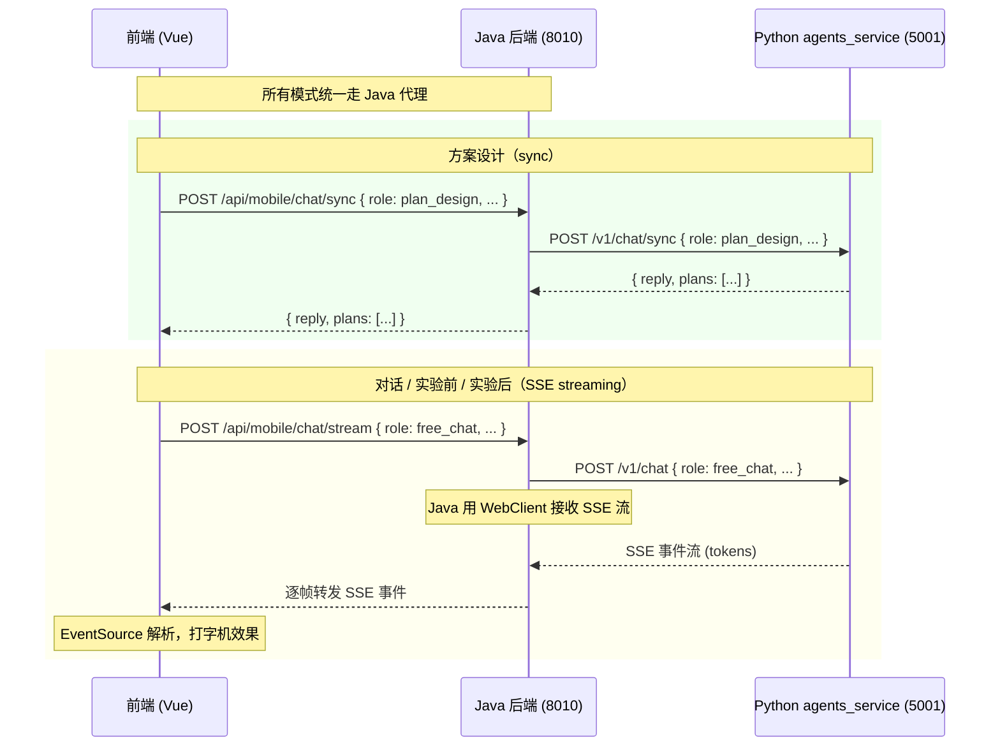

# AI 四模块开发计划（移动端）

> 范围限定：本次仅涉及 **移动端 AI 功能** 改造，不包含管理端。
> 更新日期：2026-07-01

---

## 零、问题复盘与解决方案（7 个关键问题）

### 问题 1：SSE 流式端点架构不明确

**现状**：
- 前端 `.env.production` → `VITE_API_BASE=/api` → Nginx → Java 后端（8010）
- Java 后端 → agents_service（`app.mobile.agents-base-url: http://127.0.0.1:5001`）
- agents_service 有 SSE 端点 `POST /v1/chat` 但 Java 后端当前只用 sync 端点
- 生产环境中 agents_service 端口 5001 **不对前端暴露**，前端无法直连 SSE

**解决方案**：Java 后端增加 SSE 代理转发，前端统一走 `/api` 路径，开发/生产环境路径一致。



**技术实现**（Java 后端新增 `/api/mobile/chat/stream`）：

```java
// MobileChatProxyController.java 新增 SSE 端点
@PostMapping(value = "/chat/stream", produces = MediaType.TEXT_EVENT_STREAM_VALUE)
public Flux<ServerSentEvent<String>> streamChat(@RequestBody ChatRequest request) {
    return chatProxyService.streamChat(request);
}

// MobileChatProxyService.java 新增流式转发
public Flux<ServerSentEvent<String>> streamChat(ChatRequest request) {
    return webClient.post()
        .uri("{agents_base}/v1/chat", agentsBaseUrl)
        .bodyValue(buildAgentRequest(request))
        .retrieve()
        .bodyToFlux(String.class)
        .map(data -> ServerSentEvent.<String>builder().data(data).build())
        .timeout(Duration.ofSeconds(120));  // 2 分钟超时（覆盖 LLM 长思考）
}
```

**前端适配**：统一用 `EventSource` 或 `fetch` 流式读取 Java 后端的 `/api/mobile/chat/stream`，无需区分开发/生产。

### 问题 2：视觉分析无重试/熔断机制

**解决方案**：在 `vision_review.py` 中实现 **3 级容错**：

```python
class VisionProvider:
    """
    视觉分析引擎，带重试 + 熔断机制。
    
    配置策略：
    - VISION_PROVIDER=qwen | none
    - VISION_RETRY_MAX=3          # 最大重试次数
    - VISION_RETRY_BASE_DELAY=1   # 初始退避秒数
    - VISION_TIMEOUT=15000        # 单次请求超时（毫秒）
    - VISION_CIRCUIT_BREAKER=5    # 连续失败 N 次后熔断 60s
    """
```

```python
import asyncio
import time
from functools import wraps

class CircuitBreaker:
    def __init__(self, threshold=5, recovery_timeout=60):
        self.threshold = threshold
        self.recovery_timeout = recovery_timeout
        self.failure_count = 0
        self.last_failure_time = 0
        self.state = "closed"  # closed / open / half_open

    async def call(self, fn, *args, **kwargs):
        if self.state == "open":
            if time.time() - self.last_failure_time > self.recovery_timeout:
                self.state = "half_open"
            else:
                raise ServiceUnavailableError("视觉服务熔断中")
        
        try:
            result = await fn(*args, **kwargs)
            if self.state == "half_open":
                self.state = "closed"
            self.failure_count = 0
            return result
        except Exception as e:
            self.failure_count += 1
            self.last_failure_time = time.time()
            if self.failure_count >= self.threshold:
                self.state = "open"
            raise e


async def call_vision_with_retry(client, model, messages, max_retries=3, base_delay=1.0):
    """指数退避重试"""
    last_error = None
    for attempt in range(max_retries + 1):
        try:
            response = await client.chat.completions.create(
                model=model,
                messages=messages,
                timeout=settings.vision_timeout_ms / 1000,
            )
            return response.choices[0].message.content
        except (TimeoutError, ConnectionError) as e:
            last_error = e
            if attempt < max_retries:
                delay = base_delay * (2 ** attempt)  # 1, 2, 4 秒
                await asyncio.sleep(delay)
        except Exception as e:
            # 非网络错误（如 API Key 无效）不重试
            raise e
    raise last_error  # 所有重试失败
```

**熔断状态持久化到 Redis**（可选）：
- 多个 agents_service 实例共享熔断状态
- 当前单实例用内存变量即可

### 问题 3：前端状态管理散落各处

**解决方案**：新建 **Pinia Store** 集中管理所有模块状态：

```javascript
// frontend/mobile/src/stores/chat.js
import { defineStore } from 'pinia'
import { ref, computed } from 'vue'
import { useUserStore } from './user'

const STORAGE_KEY = 'bslab-chat-state-v2'

function loadPersistedState() {
  try {
    return JSON.parse(localStorage.getItem(STORAGE_KEY)) || {}
  } catch { return {} }
}

function savePersistedState(state) {
  // 只保存需要持久化的字段（不包括 messages 等大对象）
  const persistable = {
    free: { threadId: state.free.threadId },
    pre: { threadId: state.pre.threadId },
    plan: { threadId: state.plan.threadId, savedPlans: state.plan.savedPlans },
    post: { threadId: state.post.threadId },
  }
  localStorage.setItem(STORAGE_KEY, JSON.stringify(persistable))
}

export const useChatStore = defineStore('chat', () => {
  const user = useUserStore()
  const saved = loadPersistedState()
  
  // ─── 当前模块 ───
  const currentMode = ref(
    user.isTeacher ? 'free' : 'pre'
  )
  
  // ─── 四个模块各自状态 ───
  const modes = ref({
    free: { threadId: saved.free?.threadId || '', messages: [] },
    pre:  { threadId: saved.pre?.threadId  || '', messages: [] },
    plan: { 
      threadId: saved.plan?.threadId || '', 
      messages: [],
      experimentTitle: '',
      gradeLevel: '',
      plans: [],
      savedPlans: saved.plan?.savedPlans || [],
      currentPlanIndex: -1,
    },
    post: { threadId: saved.post?.threadId || '', messages: [] },
  })
  
  // ─── 当前模块的 computed ───
  const current = computed(() => modes.value[currentMode.value])
  
  // ─── 切换模块 ───
  function switchMode(mode) {
    if (mode === currentMode.value) return
    // 离开前保存当前模块的消息到 localStorage
    persistMessages(currentMode.value)
    currentMode.value = mode
    // 加载目标模块的消息
    restoreMessages(mode)
  }
  
  // ─── 消息持久化（只保留最近 50 条） ───
  function persistMessages(mode) {
    const msgs = modes.value[mode].messages.slice(-50)
    try {
      localStorage.setItem(`bslab-msgs-${mode}`, JSON.stringify(msgs))
    } catch (e) {
      // localStorage 满时截断消息
      const truncated = msgs.slice(-20)
      localStorage.setItem(`bslab-msgs-${mode}`, JSON.stringify(truncated))
    }
  }
  
  function restoreMessages(mode) {
    try {
      const saved = localStorage.getItem(`bslab-msgs-${mode}`)
      if (saved) modes.value[mode].messages = JSON.parse(saved)
    } catch {}
  }
  
  // ─── 初始化加载 ───
  restoreMessages(currentMode.value)
  
  return {
    currentMode, modes, current,
    switchMode, persistMessages,
  }
})
```

**持久化策略**：
- `threadId` 和 `savedPlans` → `localStorage`（key: `bslab-chat-state-v2`）
- 消息历史 → `localStorage` 分模块存储（key: `bslab-msgs-${mode}`），保留最近 50 条
- `localStorage` 满时自动截断到 20 条

### 问题 4：plan_design sync 接口无超时处理

**现状**：LLM 生成 3 个方案 JSON 耗时 10-30 秒，axios 默认超时 10 秒会失败。

**解决方案**：三层超时逐级加大：

| 层面 | 配置 | 说明 |
|------|------|------|
| 前端 axios | `timeout: 120000`（2 分钟） | 覆盖最慢的 LLM 推理 |
| Java 后端 WebClient | `timeout: 120s` | 转发到 agents_service 的超时 |
| agents_service | `llm_timeout_ms` 保持 60000 | LLM 单次调用超时 60s |

```javascript
// frontend/mobile/src/api/chat.js
export async function generatePlans(params) {
  const { data } = await request.post('/mobile/chat/sync', params, {
    timeout: 120000,  // 2 分钟超时
  })
  return data
}
```

```java
// MobileChatProxyService.java
public Map<String, Object> syncChat(ChatRequest request) {
    return webClient.post()
        .uri("{agents_base}/v1/chat/sync", agentsBaseUrl)
        .bodyValue(buildAgentRequest(request))
        .retrieve()
        .bodyToMono(Map.class)
        .timeout(Duration.ofSeconds(120))
        .block();
}
```

**UI 反馈**：前端显示 `正在设计方案...` 的 Skeleton 骨架屏（非 spinning），每 10 秒更新提示文字（"AI 正在构思方案一..."）。

### 问题 5：图片压缩策略未细化

**标准化压缩方案**：

```javascript
// frontend/mobile/src/utils/imageCompress.js

/**
 * 压缩图片为合适尺寸的 base64
 * 
 * 约束条件：
 * - Qwen-VL 内部限制：超过 2048x2048 自动缩放
 * - 建议：前端预压缩到 800x800（最优质量/大小比）
 * - Base64 增量：800x800 JPEG quality 0.7 ≈ 200-300KB
 * - Java 后端有 1GB 限制（max-http-form-post-size: -1），但仍需控制大小
 * - 实际建议上限：单张 base64 < 1MB（考虑 base64 膨胀 33% → 原始约 750KB）
 */
export async function compressImage(file, options = {}) {
  const {
    maxWidth = 800,
    maxHeight = 800,
    quality = 0.7,
    maxSizeKB = 500,    // 目标压缩后不超过 500KB
  } = options

  return new Promise((resolve, reject) => {
    const reader = new FileReader()
    reader.onload = (e) => {
      const img = new Image()
      img.onload = () => {
        const canvas = document.createElement('canvas')
        let { width, height } = img

        // 等比例缩放
        if (width > maxWidth || height > maxHeight) {
          const ratio = Math.min(maxWidth / width, maxHeight / height)
          width = Math.round(width * ratio)
          height = Math.round(height * ratio)
        }

        canvas.width = width
        canvas.height = height
        const ctx = canvas.getContext('2d')
        ctx.drawImage(img, 0, 0, width, height)

        // 尝试不同的 quality 以达到目标大小
        let currentQuality = quality
        let base64 = ''
        for (let attempt = 0; attempt < 3; attempt++) {
          base64 = canvas.toDataURL('image/jpeg', currentQuality)
          const sizeKB = (base64.length * 3) / 4 / 1024  // base64 → 原始字节
          if (sizeKB <= maxSizeKB) break
          currentQuality -= 0.2  // 降低质量
        }

        resolve({
          base64,
          originalSize: file.size,
          compressedSize: Math.round((base64.length * 3) / 4),
          width,
          height,
          quality: currentQuality,
        })
      }
      img.src = e.target.result
    }
    reader.readAsDataURL(file)
  })
}
```

**调用场景**：

| 场景 | 参数 | 原因 |
|------|------|------|
| 实验后图片分析 | 800x800, quality 0.7, max 500KB | Qwen-VL 识别不需要超高分辨率 |
| 学生作品上传 | 1200x1200, quality 0.8, max 1MB | 需要保留更多细节供老师查看 |
| 头像 | 256x256, quality 0.6, max 100KB | 小图即可 |

### 问题 6：BottomSheet 数据结构复杂

**简化方案**：使用 **响应式表单 composable** + **useVModel 双向绑定**：

```javascript
// frontend/mobile/src/composables/usePlanForm.js
import { reactive, watch } from 'vue'

export function usePlanForm(initialPlan) {
  // 数据扁平化：直接用 reactive 对象，avoid 深度嵌套
  const form = reactive({
    plan_name: initialPlan?.plan_name || '',
    description: initialPlan?.description || '',
    materials: initialPlan?.materials?.map(m => ({ ...m })) || [],
    steps: initialPlan?.steps?.map(s => ({ id: genId(), text: s })) || [],
    what_you_see: initialPlan?.what_you_see || '',
    safety_tips: initialPlan?.safety_tips?.map(t => ({ id: genId(), text: t })) || [],
  })

  // 自动保存到 localStorage（防丢失）
  const AUTO_SAVE_KEY = 'bslab-editing-plan'
  watch(form, (val) => {
    localStorage.setItem(AUTO_SAVE_KEY, JSON.stringify(val))
  }, { deep: true })

  // 材料操作
  function addMaterial() { form.materials.push({ name: '', quantity: '', tip: '' }) }
  function removeMaterial(index) { form.materials.splice(index, 1) }

  // 步骤操作  
  function addStep() { form.steps.push({ id: genId(), text: '' }) }
  function removeStep(index) { form.steps.splice(index, 1) }
  function moveStep(index, direction) {
    const target = index + direction
    if (target < 0 || target >= form.steps.length) return
    ;[form.steps[index], form.steps[target]] = [form.steps[target], form.steps[index]]
  }

  // 安全提示操作
  function addSafetyTip() { form.safety_tips.push({ id: genId(), text: '' }) }
  function removeSafetyTip(index) { form.safety_tips.splice(index, 1) }

  // 恢复上次未完成的编辑
  function restoreDraft() {
    try {
      const draft = localStorage.getItem(AUTO_SAVE_KEY)
      if (draft) Object.assign(form, JSON.parse(draft))
    } catch {}
  }

  // 清除草稿（导出成功后调用）
  function clearDraft() { localStorage.removeItem(AUTO_SAVE_KEY) }

  return {
    form,
    addMaterial, removeMaterial,
    addStep, removeStep, moveStep,
    addSafetyTip, removeSafetyTip,
    restoreDraft, clearDraft,
  }
}
```

> **不实现撤销/重做**：用户场景是"编辑后导出"，不是长期文档编辑，撤销功能性价比低。

### 问题 7：Markdown 渲染性能

**优化方案**：debounce + 增量渲染 + 虚拟滚动。

```javascript
// frontend/mobile/src/composables/useMarkdownRenderer.js
import { marked } from 'marked'
import { debounce } from '@/utils/debounce'

marked.setOptions({ breaks: true, gfm: true })

// 编译缓存：避免同一文本重复解析
const compileCache = new Map()
function compile(text) {
  if (compileCache.has(text)) return compileCache.get(text)
  const html = marked.parse(sanitize(text))
  compileCache.set(text, html)
  // 缓存上限 50 条
  if (compileCache.size > 50) compileCache.delete(compileCache.keys().next().value)
  return html
}

export function useMarkdownRenderer() {
  // SSE 流式输出时，用 debounce 减少渲染次数
  const debouncedRender = debounce((content, updateFn) => {
    updateFn(compile(content))
  }, 50)  // 50ms 去抖

  function renderStreaming(content, updateFn) {
    // 流式阶段：debounce 渲染
    debouncedRender(content, updateFn)
  }

  function renderFinal(content) {
    // 最终渲染：直接编译
    return compile(content)
  }

  return { renderStreaming, renderFinal }
}
```

**消息列表性能**：
- 超过 30 条消息时启用虚拟滚动（只渲染可见区域的 10 条）
- 使用 `v-memo` 指令避免未变化消息的重新渲染
- SSE 增量更新时只更新最后一条消息的 DOM

---

## 一、技术架构（修正版）

### 1.1 请求路径统一

```
所有模式：前端 → POST /api/mobile/chat/send 或 /api/mobile/chat/stream → Java 后端 → agents_service
```

| 模式 | 前端路径 | Java 代理方式 | agents_service 端点 |
|------|----------|---------------|---------------------|
| 对话 / 实验前 / 实验后 | `POST /api/mobile/chat/stream` | WebClient 流式转发 SSE | `POST /v1/chat` (SSE) |
| 方案设计 | `POST /api/mobile/chat/sync` | 阻塞请求 + 超时 120s | `POST /v1/chat/sync` (JSON) |
| 视觉审查 | `POST /api/mobile/vision/review` | 透传转发 | `POST /v1/vision/review` |

### 1.2 配置迁移

**文件**: `agents_service/config.py`

```python
class Settings(BaseSettings):
    # ── LLM (OpenAI 兼容 API) ──
    llm_api_key: str = ""
    llm_base_url: str = "https://api.deepseek.com/v1"
    llm_model: str = "deepseek-v4-flash"       # 可配置，改 .env 即可
    llm_timeout_ms: int = 60_000

    # ── 视觉分析（Qwen-VL / 通义千问） ──
    vision_api_key: str = ""                     # 阿里云百炼 DASHSCOPE_API_KEY
    vision_base_url: str = ""                    # https://{WorkspaceId}.cn-beijing.maas.aliyuncs.com/compatible-mode/v1
    vision_model: str = "qwen3-vl-plus"          # 可切换
    vision_timeout_ms: int = 15_000
    vision_retry_max: int = 3                    # 最大重试次数
    vision_retry_base_delay: float = 1.0         # 重试初始间隔（秒）
    vision_circuit_breaker_threshold: int = 5    # 连续失败 N 次后熔断
```

---

## 二、任务分解（11 个任务）

### 任务 1：config.py + vision_review.py（含重试/熔断）

**文件**: `agents_service/config.py`, `agents_service/bs_lab_adapter/tools/vision_review.py`

| 步骤 | 内容 |
|------|------|
| 1.1 | config.py: `llm_model` 改为 `deepseek-v4-flash`，新增 vision 配置项 |
| 1.2 | vision_review.py: `CircuitBreaker` 类 + `call_vision_with_retry()` |
| 1.3 | `VisionProvider` 类：支持 qwen / none 切换，降级返回结构化空结果 |
| 1.4 | `POST /v1/vision/review` 路由挂载 |

---

### 任务 2：Agent 注册 + free_chat + server.py role 感知

**文件**: `main.py`, `free_chat_graph.py`, `server.py`

| 步骤 | 内容 |
|------|------|
| 2.1 | main.py: 注册 4 个 agent |
| 2.2 | free_chat_graph.py: 最小化状态，无阶段约束 |
| 2.3 | server.py: `_build_new_session_state()` role 感知 |
| 2.4 | server.py: sync 接口通过 role 路由到对应 graph（plan_design 用） |

---

### 任务 3：plan_design_graph.py 方案设计 agent

**文件**: `plan_design_graph.py`, `schemas/plan_design.py`

| 步骤 | 内容 |
|------|------|
| 3.1 | PlanDesignState: messages, experiment_title, grade_level, plans |
| 3.2 | 单节点 graph: LLM 生成 3 方案 JSON（含 description/materials/steps/what_you_see/safety_tips） |
| 3.3 | OutputEngine fallback 模板 |

---

### 任务 4：post_experiment_graph.py 实验后 agent

**文件**: `post_experiment_graph.py`

| 步骤 | 内容 |
|------|------|
| 4.1 | PostExperimentState: messages, current_stage, image_base64 |
| 4.2 | 4 阶段 FSM: DATA_ANALYZE → RESULT_JUDGE → CONCLUSION → FEEDBACK |
| 4.3 | ToolNode 调用 vision_review（图片分析时） |
| 4.4 | 纯文字分析逻辑 |

---

### 任务 5：Java 后端扩展（含 SSE 代理转发）

**文件**: `MobileChatProxyController.java`, `MobileChatProxyService.java`, `MobileVisionReviewController.java`

| 步骤 | 内容 |
|------|------|
| 5.1 | `SUPPORTED_AGENT_ROLES` 扩展 |
| 5.2 | ChatRequest DTO 新增 `experiment_title`, `grade_level`, `image_base64` |
| 5.3 | **核心**: `POST /api/mobile/chat/stream` 端点，WebClient 流式转发 SSE + 超时 120s |
| 5.4 | `POST /api/mobile/vision/review` 代理 |

---

### 任务 6：前端全局状态 + 4 模块 SegmentedControl

**文件**: `src/stores/chat.js`（新增）, `AssistantChatView.vue`

| 步骤 | 内容 |
|------|------|
| 6.1 | `stores/chat.js`: Pinia store — 4 模块独立 threadId + messages + 持久化 |
| 6.2 | 顶部 SegmentedControl 4 模块 + 角色默认 |
| 6.3 | URL query `?mode=free|pre|plan|post` 解析 + 路由同步 |
| 6.4 | 模块切换时消息区/欢迎语/交互区联动 |

---

### 任务 7：前端 SSE 流式接入 + Markdown 渲染

**文件**: `api/chat.js`, `utils/markdown.js`, `utils/imageCompress.js`, `AssistantChatView.vue`

| 步骤 | 内容 |
|------|------|
| 7.1 | `api/chat.js`: `sendChatMessageStream()` 改为 POST Java 后端（非直连 agents_service） |
| 7.2 | SSE 增量打字机效果 |
| 7.3 | `utils/markdown.js`: marked + 缓存 + XSS 过滤 + debounce |
| 7.4 | 消息气泡样式：头像/角色名/时间/圆角/阴影 |
| 7.5 | 代码块深色背景 + 行内 code 样式 |
| 7.6 | 超过 30 条消息启用虚拟滚动（`vue-virtual-scroller` 或原生 `v-memo`） |
| 7.7 | `api/chat.js`: `generatePlans()` 独立方法，timeout: 120000 |

---

### 任务 8：快捷场景优化

**文件**: `AssistantChatView.vue`

| 步骤 | 内容 |
|------|------|
| 8.1 | 对话模块快捷场景：6-8 个科普类话题，圆角卡片+图标，可横向滑动 |
| 8.2 | 发送后自动收起 |

---

### 任务 9：方案设计模块（卡片 + BottomSheet + A4 导出）

**组件**: `PlanCardGrid.vue`, `PlanEditSheet.vue`, `A4DocumentPreview.vue`, `composables/usePlanForm.js`, `composables/usePlanExport.js`

| 步骤 | 内容 |
|------|------|
| 9.1 | 方案模式交互区：实验名称 + 年级 + "开始设计" |
| 9.2 | `PlanCardGrid.vue`: 响应式 3 卡片网格 |
| 9.3 | `usePlanForm.js`: reactive 表单 + 自动 localStorage 保存 |
| 9.4 | `PlanEditSheet.vue`: BottomSheet，6 个编辑区 |
| 9.5 | `A4DocumentPreview.vue`: A4 格式预览 + 品牌 footer |
| 9.6 | `usePlanExport.js`: html2canvas + jspdf 导出 |
| 9.7 | 调用 sync 接口（超时 120s）+ Skeleton 骨架屏 |

---

### 任务 10：实验后模块（图片上传 + 视觉审查展示）

**文件**: `api/vision.js`, `AssistantChatView.vue`

| 步骤 | 内容 |
|------|------|
| 10.1 | 图片上传按钮（相机 + 相册） |
| 10.2 | `utils/imageCompress.js` → 标准压缩（800x800, q0.7, max 500KB） |
| 10.3 | `api/vision.js`: 封装 POST Java 后端 |
| 10.4 | 审查结果展示组件：物品检测 / 安全 / 规范 / 评分 |

---

### 任务 11：依赖安装

```bash
cd frontend/mobile
npm install html2canvas jspdf marked
```

---

## 三、执行顺序

```
任务1 (config+vision重试熔断)
  └── 任务2 (agent注册+free_chat+server role感知)
        ├── 任务3 (plan_design agent) ───┐
        ├── 任务4 (post_experiment agent) │
        │                                │
        └── 任务5 (Java SSE代理+角色扩展) ─┼┤
                                          ││
任务6 (Pinia store + SegmentedControl) ───┼┤
  ├── 任务7 (SSE流式+Markdown渲染) ───────┘│
  ├── 任务8 (快捷场景) ────────────────────┘
  ├── 任务9 (方案设计UI) ← 依赖任务3
  ├── 任务10 (实验后UI) ← 依赖任务4
  └── 任务11 (安装包)
```

---

## 四、文件变更清单

| 文件 | 变更 | 说明 |
|------|------|------|
| `agents_service/config.py` | 修改 | 模型名可配置 + 视觉重试/熔断配置 |
| `agents_service/main.py` | 修改 | 注册 4 agent + vision 路由 |
| `agents_service/agents_framework/server.py` | 修改 | `_build_new_session_state` role 感知 |
| `agents_service/bs_lab_adapter/graphs/free_chat_graph.py` | 新增 | 透明对话 agent |
| `agents_service/bs_lab_adapter/graphs/plan_design_graph.py` | 新增 | 方案设计 agent |
| `agents_service/bs_lab_adapter/graphs/post_experiment_graph.py` | 新增 | 实验后分析 agent |
| `agents_service/bs_lab_adapter/schemas/plan_design.py` | 新增 | 方案设计 Schemas |
| `agents_service/bs_lab_adapter/tools/vision_review.py` | 新增 | 视觉审查 + 重试/熔断 |
| `backend/.../mobile/service/MobileChatProxyService.java` | 修改 | 角色扩展 + SSE 流式转发 |
| `backend/.../mobile/controller/MobileChatProxyController.java` | 修改 | 新增 `/chat/stream` 端点 |
| `backend/.../mobile/controller/MobileVisionReviewController.java` | 新增 | `/vision/review` 代理 |
| `frontend/mobile/package.json` | 修改 | 新增 html2canvas + jspdf + marked |
| `frontend/mobile/src/api/chat.js` | 修改 | 新增 `generatePlans()` + SSE 路径调整 |
| `frontend/mobile/src/api/vision.js` | 新增 | 视觉审查封装 |
| `frontend/mobile/src/utils/markdown.js` | 新增 | Markdown 渲染 + 缓存 + debounce |
| `frontend/mobile/src/utils/imageCompress.js` | 新增 | 图片压缩标准化 |
| `frontend/mobile/src/stores/chat.js` | 新增 | Pinia store 全局 chat 状态 |
| `frontend/mobile/src/composables/usePlanForm.js` | 新增 | 编辑表单状态管理 |
| `frontend/mobile/src/composables/usePlanExport.js` | 新增 | html2canvas + jspdf 导出 |
| `frontend/mobile/src/views/assistant/AssistantChatView.vue` | 重构 | 4 模块 + SS E + Markdown + Pinia |
| `frontend/mobile/src/views/assistant/PlanCardGrid.vue` | 新增 | 方案卡片网格 |
| `frontend/mobile/src/views/assistant/PlanEditSheet.vue` | 新增 | 编辑 BottomSheet |
| `frontend/mobile/src/views/assistant/A4DocumentPreview.vue` | 新增 | A4 预览导出 |
