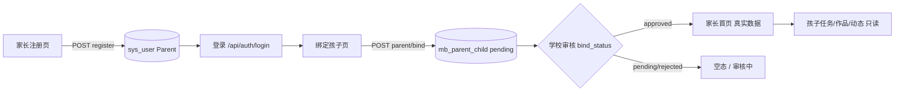

# 去 Mock 深度分析（产品 × 架构）

> 日期：2026-06-05  
> 视角：产品经理（功能闭环、角色、验收）+ 资深架构师（数据主权、边界、演进）  
> 前提：Tier 1 表已执行；**不创建种子用户**；以 `sys_user` 内建账号为唯一身份源  
> 本文 **只做分析与决策依据**，不涉及代码改动  
> 战术步骤见：[mobile-no-mock-execution-plan.md](./mobile-no-mock-execution-plan.md)

---

## 一、执行摘要（给决策者）

### 1.1 结论一句话

> **「彻底消除 mock」≠ 删掉一个 JS 文件**，而是：**每条用户可见的业务事实都必须能追溯到 `sys_*` / `exp_*` / `mb_*` 或运行时计算**；其余只能是 **空态 UI** 或 **明确标注的静态文案（版本号等）**。

当前距离目标还差 **三层断链**：

| 层 | 现状 | 目标 |
|----|------|------|
| **数据** | `mb_*` 仍绑 demo-* ID，与 6 个内建用户脱节 | 业务行只含真实 `user_id`，或由 App 写操作产生 |
| **后端** | 7 个 Service 在「空/404」时整包替换 `MobilePrototypeData` | 空 → `[]` / 404；仅配置项可保留 demo profile |
| **前端** | 20+ 页面以 `PROTOTYPE` 为 **初始主数据** | 首屏只信 API；`PROTOTYPE` 仅网络失败 |

### 1.2 产品就绪度（按角色）

| 角色 | 内建账号 | 可验收「无 mock」的核心链路 | 当前阻塞 |
|------|----------|---------------------------|----------|
| **学生** | ✅ `zhangxm` | 首页/实验/任务/作品/答题/通知 | 任务/作品查不到（user_id 不匹配）；答题题目仍 Java mock |
| **教师** | ✅ `gaoy` / `liangwy` | 布置作业（写 API 已有）、批阅/看板 | 批阅/看板 **纯前端 mock**；布置页班级/实验硬编码 |
| **家长** | ✅ **移动端自助注册**（无需种子用户） | 注册→登录→绑定孩子→家长首页 | 注册 API 未建；绑定仍 mock 查孩子；dashboard 实验/动态仍 prototype |
| **管理员** | ✅ `admin` 等 | 非移动端主路径 | — |

### 1.3 架构原则（去 mock 后的目标态）

```
                    ┌─────────────────────────┐
                    │   sys_user（身份唯一）   │
                    └───────────┬─────────────┘
                                │
         ┌──────────────────────┼──────────────────────┐
         ▼                      ▼                      ▼
   exp_* / sys_msg         mb_*（移动扩展）        运行时聚合
   实验/消息/组织/题库      任务/作品/答题/绑定      COUNT/JOIN/排行
         │                      │                      │
         └──────────────────────┴──────────────────────┘
                                │
                         /api/mobile/*
                                │
                         前端（空态 | 真实数据）
                                │
                    仅 offline：网络错误兜底（非业务 mock）
```

**反模式（必须清零）**：

- 三处维护同一业务事实（SQL seed / Java / JS）
- `demo-student-001` 与登录 user_id 不一致仍「偷看」种子数据
- 统计为 0 时 **替换成** prototype 数字（`withPrototypeStat`）
- 页面内 **写死** 用户列表、班级 Tab、分数文案

---

## 二、Mock 全景盘点（共 4 类来源）

### 2.1 来源 A · 前端 `prototypeFallbacks.js`（≈250 行业务 mock）

| 数据块 | 影响页面 | 产品含义 |
|--------|----------|----------|
| `tasksDemo` / `taskDetails` | TasksView, TaskDetailView | 任务列表/详情 |
| `works` / `workComments` | WorksView, WorkDetailView | 作品墙/评论 |
| `quiz.*` | Quiz 全系列 6 页 | 题目/历史/连对 |
| `badges` | BadgeWallView | 勋章墙 |
| `growth.*` | GrowthArchiveView | 成长档案/方案 |
| `parentDashboard.*` | HomeParent, ParentDashboardBody | 家长看板 |
| `profile.*` | ProfileView, SettingsView, HomeTeacher | 各角色统计/时间线 |
| `bind.*` | BindChildView | 学校/年级/班级 |
| `upload.*` | UploadView | 上传预览/关联任务 |
| `reviewPending` | ReviewView | 待批阅队列 |
| `teacherAi.*` | TeacherAiView | 教师 AI 固定回复 |
| `student/parent/teacher/device/app` | SettingsView, 工具函数 | 学号/绑定/设备/版本 **占位** |

另有 **页面内联 mock**（未进 PROTOTYPE 对象）：

| 页面 | 内联 mock |
|------|-----------|
| `ContentDetailView` | 留言列表、点赞 toggle（仅改本地 state） |
| `ProgressBoardView` | 学生名单、提交率数字 |
| `QuizCompletedView` | 5/5、+20 分、连对 4 天 |
| `AssignView` | 班级/实验 `<option>` 硬编码 |
| `VoiceSearchView` | 随机 demo 关键词 |
| `ParentRegisterView` | 整页无 API |

### 2.2 来源 B · 后端 `MobilePrototypeData.java`

与 JS **刻意对齐**的 Java 副本，在以下情况 **整包注入**：

| Service | 触发条件 |
|---------|----------|
| `MobileTaskService` | `mb_task` 空；或 taskId 404 |
| `MobileWorkService` | `mb_work` 空；或 workId 404 |
| `MobileLearningService` | 答题 **题目始终**来自此类；badges/growth 空 |
| `MobileHomeService` | 家长看板无绑定；实验/动态 **混合** prototype |

### 2.3 来源 C · `MobileUserContext` DEMO 回退

登录用户查不到个人数据时，**改用** `demo-student-001` 等 ID 再查库 → 造成「用 zhangxm 登录却看到 seed 里张小明数据」的假象（若改绑后甚至更混乱）。

### 2.4 来源 D · SQL seed（`mobile_demo_seed.sql` 历史数据）

- 与 `sys_user` **无 FK**，demo-* ID 不在库内  
- 产品决策：**不再执行**；现有行 **改绑** 到 `zhangxm`/`gaoy` 或 **truncate 后走 App 产生数据**

---

## 三、功能 × 数据库 × Mock 核对矩阵

图例：**DB** 已有表可读 · **API** 移动端已接 · **Mock** 仍展示假数据 · **空** 应显示空态 · **缺** 需新 API/表 · **静态** 非业务数据

### 3.1 学生端（主路径 `zhangxm`）

| 功能/路由 | 产品价值 | Layer A 表 | Layer B 表 | API | 现状 | 去 Mock 策略 |
|-----------|----------|------------|------------|-----|------|--------------|
| 登录 | P0 | `sys_user` | — | auth | DB | ✅ 已完成 |
| 首页 Feed | P0 | `exp_msg`, `exp_video`, `exp_simulator` | — | home/feed | DB | ✅ |
| 搜索/语音 | P1 | `exp_msg` | — | home/search | DB + 语音 Mock | 语音保留 POC；搜索 ✅ |
| 实验详情 | P0 | `exp_*`, `data_file` | **`mb_comment`, `mb_user_reaction`** | exp/* + social | DB + **Mock 社交** | 统一 Social API；同步 `exp_msg.*_num` |
| 模拟实验 | P1 | `exp_simulator` | — | simulators | DB | ✅ |
| 通知 | P0 | `sys_msg`, `school_notice` | — | messages | DB | ✅ |
| 石头老师 | P1 | `ai_chat_*` | — | chat | 混合 | AI 动态；欢迎语可静态 |
| 我的任务 | P0 | — | `mb_task`, `mb_task_submission` | tasks | **Mock 混合** | 去 fallback；`video_id`→`exp_id` |
| 任务详情 | P0 | `exp_msg`（关联） | 同上 | tasks/{id} | **Mock 混合** | 同上 |
| 作品墙 | P0 | — | `mb_work` | works | **Mock 混合** | 去 fallback；按当前 user 过滤 |
| 作品详情 | P0 | `data_file` | `mb_work`, `mb_work_file`, `mb_comment` | works/{id} | **Mock 混合** | 附件读 + 评论 API |
| 上传 | P0 | `data_file` | `mb_work`, `mb_work_file` | works POST + files | **Mock 混合** | 真实选文件 + upload API |
| 每日答题 | P1 | **`exp_question`** | `mb_quiz_daily`, `mb_quiz_record` | quiz | **题目 Mock** | 读题库；历史读 record |
| 答题记录/完成页 | P1 | — | `mb_quiz_record` | quiz | **Mock** | 读 record；Completed 接 API |
| 勋章墙 | P1 | `sys_user.per_score` | **`mb_badge_*`（Tier 1.5 必建）** | badges | **Mock 混合** | 执行 feature 表 + 定义 seed；**行为触发** progress，关 fallback |
| 成长档案 | P2 | `per_score` | `mb_growth_event`（可选） | growth | **Mock 混合** | 事件聚合 work/quiz/task |
| 个人中心 | P0 | `sys_user`, `sys_org` | 多表聚合 | profile, browse-stats | **Mock 混合** | 扩展 browse-stats；去掉 withPrototypeStat |
| 设置 | P1 | `sys_user` | — | profile | **Mock 混合** | 账号真实；通知偏好 **产品待定** |

### 3.2 教师端（`gaoy` / `liangwy`）

| 功能 | Layer A | Layer B | API | 现状 | 去 Mock |
|------|---------|---------|-----|------|---------|
| 布置作业 | `exp_msg`, `sys_org` | `mb_task` | POST tasks | 写 OK；**选项 Mock** | org 树 + exp 列表 API |
| 批阅 | `sys_user`, `data_rating_scale` | `mb_work`, `mb_task_submission` | **缺** | **纯 Mock** | 新增 teacher/reviews + grade |
| 班级看板 | `sys_org`, `sys_user` | `mb_task_submission` | **缺** | **纯 Mock** | 按 class 聚合 submission |
| 教师首页/Profile 统计 | 同上 | `mb_task`, `mb_work` | browse-stats **不全** | **Mock 数字** | SQL 聚合 |
| 教师 AI | — | — | chat（可复用） | **静态回复 Mock** | 接 chat API 或标「演示」 |

### 3.3 家长端（**自助注册，不依赖种子用户**）

> **产品前提**：家长通过 `/register/parent` 自行申请账号，写入 `sys_user`（`user_role_id = Parent`），**不在管理端预建 Parent 用户**。  
> 页面文案已约定：「注册后需绑定孩子并等待学校审核通过方可使用完整功能。」

#### 3.3.1 家长闭环（目标态）



| 阶段 | 功能 | Layer A | Layer B | API | 现状 | 去 Mock 策略 |
|------|------|---------|---------|-----|------|--------------|
| **开户** | 家长注册 | `sys_user`, `data_role` | — | **缺** `POST /mobile/auth/parent/register` | **Mock** alert | 写 `sys_user`；`login_name`=手机号；`user_role_id=Parent`；`root_org_id`=所选学校 |
| **开户** | 短信验证码 | — | — | **缺**（可 MVP 跳过） | stub alert | 配置项 `mobile.sms-enabled`；关时仅校验手机号格式 |
| **登录** | 家长登录 | `sys_user` | — | `POST /auth/login` ✅ | **混合** | 登录后 **必须用服务端 `userRoleId`**，禁止 UI Tab 覆盖角色 |
| **绑定** | 选学校/年级/班级 | `sys_org` | — | **缺** B4 org API | **Mock** `PROTOTYPE.bind` | `GET /mobile/org/bind-options` |
| **绑定** | 查孩子 | `sys_user`（Student） | — | **缺** 搜索 API | **Mock** 姓名→demo ID | 按 org + 姓名/学号查 Student；**禁止** `CHILD_NAME_TO_USER_ID` |
| **绑定** | 提交绑定 | — | `mb_parent_child` | `POST /parent/bind` ✅ | **Mock 孩子 ID**；且 **直接 approved** | `bind_status=pending`；审核前不展示孩子业务数据 |
| **使用** | 家长首页 | `sys_user`, `exp_msg` | `mb_parent_child`, `mb_task_submission`, `mb_work` | `GET /home/parent-dashboard` | **混合** | 孩子列表/待办数读库；实验/动态 **去 prototype 填充**，改聚合真实事件 |
| **使用** | 多孩切换 | — | `mb_parent_child.is_default` | 同上 | UI 有；部分 Mock | 只展示 `bind_status=approved` 的孩子 |

#### 3.3.2 权限与空态（产品规则）

| 状态 | 家长可见 | 数据来源 |
|------|----------|----------|
| 已注册、未绑定 | 引导「去绑定孩子」；首页空态 | 无 `mb_parent_child` |
| 已绑定、`pending` | 「审核中」；**不展示**孩子任务/作品/实验 | `mb_parent_child.bind_status` |
| 已绑定、`approved` | 完整家长首页（只读孩子数据） | 绑定表 + 孩子 `user_id` 聚合 |
| 已绑定、`rejected` | 拒绝原因 + 重新绑定 | 同上 |

**与去 Mock 的关系**：家长端 **不再因「库内无 Parent 用户」而跳过验收**；E2E 路径为 **现场注册一个新家长**，绑定 `zhangxm`，审核通过后看真实 dashboard。

#### 3.3.3 不新建表、不改 Layer B 档位

- 账号：`sys_user` + 可选 `sys_user_role`（与现有用户模型一致）
- 绑定：`mb_parent_child`（Tier 1 已有，`bind_status` 字段已支持 pending/approved/rejected）
- 学校审核：**MVP 可配置自动通过**（`mobile.parent-bind-auto-approve: true` 仅 dev）；生产默认 `pending`，由管理端或后续审核 API 改状态
- **禁止**：为家长注册单独建 `mb_parent_register` 等表（除非后续要做独立审核工单，非 MVP）

---

## 四、架构视角：每条 mock 的消除策略（四类）

### 类型 1 · 接线即可（DB + 表已有，API 部分已有）

**工作量小；应最先做**

|  mock 块 | 真实来源 | 动作 |
|----------|----------|------|
| tasksDemo | `mb_task` + submission | 关 fallback + user_id 对齐 |
| works.items | `mb_work` | 同上 |
| quiz.history | `mb_quiz_record` | LearningService 只读 record |
| badges | `mb_badge_*` + **BadgeGrantService** | 建表 + 行为触发，关 fallback |
| growth.timeline（若保留表） | `mb_growth_event` | 关 fallback |
| 登录 Profile | `sys_user` | 已 OK；去掉学号 placeholder 函数 |

### 类型 2 · 需新增 Mobile API（表已有或 Layer A 可算）

| mock 块 | 方案 | 新/改 API |
|---------|------|-----------|
| quiz.questions | **`exp_question` + `mb_quiz_daily`** | 改 GET quiz/today |
| workComments | `mb_comment` | GET/POST comments |
| 实验详情留言/点赞 | `mb_comment`, `mb_user_reaction` + `exp_msg.*_num` | reactions API |
| reviewPending | `mb_work` WHERE pending | GET teacher/reviews |
| bind.schools | **`sys_org` 树** | GET org/bind-options |
| upload.files | 前端 File + **`data_file`** | 已有 upload；UploadView 接线 |
| profile 统计 | SQL 聚合 | 扩展 GET browse-stats 或 profile/stats |
| parentDashboard 动态 | `sys_msg` + 最近 `mb_work` | 增强 parent-dashboard |
| **家长注册** | 写 `sys_user`（Parent） | `POST /mobile/auth/parent/register` |
| **按 org 查学生** | `sys_user` JOIN `sys_org` | `GET /mobile/parent/students/search` |
| ProgressBoardView | `mb_task_submission` JOIN class | GET teacher/board |
| AssignView 选项 | `exp_msg` + `sys_org` | GET teacher/exp-options, classes |

### 类型 3 · 需产品拍板（是否做 / 怎么做）

| 项 | 问题 | 建议 |
|----|------|------|
| **勋章体系** | 库不支持则 **必建** `mb_badge_*` | 执行 `mobile_feature_tables.sql` + 定义 seed；进度 **运行时授予**，不用 demo 进度 seed |
| **成长方案** | `growth.plan` 存哪？ | MVP：**不做持久化**；弹层仅本地或砍掉 |
| **家长短信** | 注册是否必须真短信？ | MVP：`sms-enabled=false` 时仅格式校验；生产再接短信网关 |
| **绑定审核** | 谁改 `bind_status`？ | MVP：dev 自动 approved；生产 pending + **管理端改状态**（或后续 mobile 审核 API） |
| **设备管理/微信绑定** | Settings 展示 | **静态「未绑定」** 或隐藏入口 |
| **TeacherAi 固定回复** | 是否接 LLM？ | 接 `/mobile/chat` 或独立入口标 demo |
| **语音搜索** | POC | 保留随机词 **但不算业务 mock**（可接受） |

### 类型 4 · 非业务 mock（可保留）

| 项 | 处理 |
|----|------|
| App 版本号 | `import.meta.env` / 构建注入 |
| 空态插图/文案 | 前端 i18n，非假业务数据 |
| 网络失败兜底 | 薄 `offlineFallbacks`（无 tasksDemo 级数据） |

---

## 五、与现有库的对齐问题（架构债）

| 问题 | 影响 | 处理建议 |
|------|------|----------|
| **user_id 不一致** | 登录用户看不到 mb 数据 | `migrate_mb_to_sys_user.sql` 或清空后 App 写 |
| **Collation 不一致** | `exp_question` JOIN `mb_quiz_daily` 报错 | 统一 collation 或 SQL COLLATE |
| **task.video_id 假 id** | 任务详情无法打开真实实验 | 改绑为 `exp_msg.exp_id` |
| **browse-stats 过窄** | Profile 只能拿到 exp 总数 | 扩展为按 user 的 work/task/quiz 聚合 |
| **登录 Tab 覆盖角色** | 家长注册后选错 Tab 仍进错首页 | 登录 **只信服务端 `userRoleId`** |
| **绑定默认 approved** | 未审核即看到业务数据 | 生产 `bind_status=pending`；dev 可配置自动通过 |
| **browse-stats 无 user 维度** | 教师/家长统计造假 | 新 API 必须带 `X-User-Id` 聚合 |

---

## 六、产品里程碑（建议 4 个 Release）

### Release 1 · 「真实身份闭环」（学生 + 教师写路径）

**目标**：zhangxm / gaoy 登录后，任务/作品/答题 **写入与读出同一 user_id**，零 prototype 主路径。

- 数据：改绑或清空 mb_*  
- 后端：关 fallback + 删 DEMO 回退  
- 前端：Tasks/Works/Quiz 初始空数组  
- 答题：接 `exp_question`  
- **验收**：关闭 fallback 后学生能看自己的任务、提交作品、答今日题

### Release 2 · 「家长自助注册 + 绑定闭环」

**目标**：新家长 **移动端注册 → 登录 → 绑定 zhangxm →（审核通过）→ 家长首页无 prototype**。

- 后端：`POST /mobile/auth/parent/register`；`MobileParentService` 按 org+姓名查 Student；`bind_status` 可配置  
- 前端：`ParentRegisterView` / `BindChildView` 接 API；`LoginView` 用服务端角色  
- Dashboard：去掉 `getParentDashboard` 对 prototype 实验/动态的填充  
- **验收**：新注册家长账号可登录；绑定后 pending 显示审核中；approved 后看到孩子真实 pending/completed 数

### Release 3 · 「社交 + 勋章 + 教研员」

**目标**：实验 / 模拟实验 / 作品 **全站社交**；勋章 **可正常获得**；教研员可在移动端点评。

- SQL：`mobile_feature_tables.sql` + `mobile_badge_def_seed.sql`
- API：Comments / Reactions / BadgeGrant；`exp_msg.*_num` 与 reaction 同步
- 前端：ContentDetailView、WorkDetailView、VirtualExpDetailView 接社交 API
- 教研员：`yuanf` 登录 → `user_role_tag=researcher` 评论；扩展 BottomNav（见 §11.4）
- **验收**：三端内容均可留言点赞；zhangxm 提交作品后可解锁「科学新星」类勋章

### Release 4 · 「语音 + 治理」

- 语音：浏览器 ASR MVP + 可选云 ASR 代理（见 §11.2）
- 删除 `MobilePrototypeData`；`prototypeFallbacks` → `offlineFallbacks`
- **验收**：grep 无业务级 PROTOTYPE；VoiceSearch 非随机 demo 词

---

## 七、「彻底消除 mock」验收清单（产品 + 架构联合签字）

### 7.1 数据层

- [ ] `mb_*` 中 **无** `demo-%` user_id  
- [ ] 任意业务行 `student_user_id` / `parent_user_id` 均 ∈ `sys_user`  
- [ ] 新写入数据 refresh 后仍在且归属当前登录 user  
- [ ] 不再执行含 demo 用户的 seed  

### 7.2 后端

- [ ] `mobile.demo-fallback-enabled=false` 下 **无** `MobilePrototypeData` 调用  
- [ ] **无** `MobileUserContext.DEMO_*` 二次查询  
- [ ] 404/空列表 JSON 结构稳定（前端可空态）  
- [ ] 答题判分来自 `exp_question_select.is_right`  

### 7.3 前端

- [ ] 28 条路由中，**P0 路由** onMounted **不 import** 业务 PROTOTYPE 块  
- [ ] 统计为 0 显示 **0**，不显示 prototype 的 12/42/680  
- [ ] Settings 无假「绑定 2 个孩子」 unless DB 真有  
- [ ] 仅 `catch (networkError)` 使用 offline 兜底  

### 7.4 角色冒烟

| 账号 | 必测路径 |
|------|----------|
| zhangxm | 任务→上传→作品墙→答题→通知 |
| gaoy | 布置→（R3）批阅→看板 |
| **新注册家长** | 注册→登录→绑定→pending 空态→（审核后）家长首页 |

---

## 八、产品决策（已全部确认 · 2026-06-05）

完整规格：**[mobile-product-spec.md](./mobile-product-spec.md)** · 开发门禁 **G1–G5 ✅**

| 编号 | 结论 |
|------|------|
| 9.1 → **A** | 家长完整社交 **仅 `bind_status=approved` 后** |
| 9.2 → **A** | 批准管理端：**家长角色审核**、绑定审核、勋章、评论管理 |
| 9.3 | **仅 Sys_Admin** 软删评论；移动端不展示；**管理后台可见** |
| 9.4 → **A** | 勋章支持管理端 **手动授予/撤销** |
| 9.5 → **A** | `mb_parent_child` 增加审核人/时间/驳回原因（必跑 DDL） |

**实施顺序**： [mobile-no-mock-execution-plan.md](./mobile-no-mock-execution-plan.md) **Phase R0** → R1 → …
---

## 九、与执行计划的关系

| 文档 | 定位 |
|------|------|
| **本文** | 产品范围、mock 全景、DB 核对、Release 划分、验收标准 |
| [mobile-no-mock-execution-plan.md](./mobile-no-mock-execution-plan.md) | 工程 Phase A–D、SQL 改绑、文件级任务 |
| [mobile-test-data-playbook.md](./mobile-test-data-playbook.md) | **管理端造数手册**（替代 demo seed） |
| [mobile-data-source-audit.md](./mobile-data-source-audit.md) | 页面级 API 对照 |
| [mobile-sql-decision.md](./mobile-sql-decision.md) | 表档位；去 mock **不新增**禁止表 |

**建议下一步（仍不改代码）**：

1. 产品确认 **§八** 表中 2–7（1 家长自助注册已确认）  
2. DBA/开发执行 **改绑或清空** 决策  
3. 按 **Release 1 → Release 2（含家长注册）** 排 sprint

---

## 十、附录：内建用户速查

| login | user_id | role | 移动端 |
|-------|---------|------|--------|
| zhangxm | a6ef4dd7298d4914ae58d2dccc136ae8 | Student | 学生主测 |
| gaoy | 9a77dde99aaa4b689bd69ddfdedb6cb0 | Teacher | 教师主测 |
| liangwy | 220f1898089145dd92e0c0f351e9d9bb | Teacher | 教师备选 |
| bhy_admin | 0601ff00334343d49e116055fb3be56a | School_Admin | 非移动主路径 |
| admin | Sys_Admin | Sys_Admin | — |
| yuanf | ab786f33c05b4df198079458365688df | Researcher | 教研移动端（R3）：浏览 + 教研点评 |

**Parent 角色**：`data_role` 已有 **Parent** 定义；**首个家长账号由移动端注册产生**，不写入 seed SQL。

---

## 十一、专项决策（2026-06-05 补充）

### 11.1 勋章功能 · 数据库与正常化

**结论**：勋章 **不是可选 demo**；若库中无 `mb_badge_*`，须 **建表** 后功能才算正常。

| 项 | 方案 |
|----|------|
| 建表脚本 | **`sql/mobile/mobile_feature_tables.sql`**（Tier 1.5，与社交表同文件） |
| 定义数据 | **`sql/mobile/mobile_badge_def_seed.sql`**（8 枚勋章，**无 demo user 进度**） |
| 进度数据 | **`mb_badge_progress` 仅由运行时写入**：提交作品、完成任务、答题等触发 `MobileBadgeGrantService` |
| 与积分 | `sys_user.per_score` 仍作积分展示；勋章墙 **只读 badge 表**，不与 prototype 混用 |
| 成长档案 | `mb_growth_event` 仍为 **可选**；MVP 可由 work/quiz/badge 事件 **聚合生成** timeline |

**criteria_type 与触发点（MVP）**

| criteria_type | 触发时机 |
|---------------|----------|
| `work_first` / `work_submit_count` | `POST /works` 成功后 |
| `exp_task_done` | `mb_task_submission.state=done` |
| `quiz_first` / `quiz_correct` / `quiz_streak` | `POST /quiz/submit` 成功后 |
| `work_featured` | 教师批阅标记展示（R2 批阅 API） |

---

### 11.2 语音功能 · 方案推荐

**推荐：混合策略（先浏览器、后云端），不推荐服务器自建语音库。**

| 方案 | 适用 | 优点 | 缺点 |
|------|------|------|------|
| **A. 浏览器 Web Speech API**（**MVP 首选**） | `VoiceSearchView`、`AssistantChatView` 语音输入 | 零成本、无后端、隐私好、开发 1～2 天 | iOS Safari 支持差；需 HTTPS；普通话准确率一般 |
| **B. 国内云 ASR 在线 API**（**生产推荐**） | 同上，通过后端代理 | 普通话准确、全平台一致、可录短音频 | 按量计费；需密钥与合规 |
| **C. 服务器自建 Whisper/Vosk** | 仅 **内网离线** 硬性要求 | 数据不出域 | GPU/运维成本高、延迟大，**与 K12 移动端不匹配** |

**推荐落地路径**

```
Phase 1（R4 初）：
  前端 feature-detect SpeechRecognition
  → 成功则实时转写 → router.push(search?q=...)
  → 不支持则提示「请改用文字搜索」

Phase 2（可选）：
  POST /api/mobile/asr/transcribe（multipart 音频）
  → 阿里云智能语音 / 科大讯飞 一句话识别
  → 配置 mobile.asr-provider: browser | aliyun | xunfei
```

**不推荐** 在应用服务器安装本地语音识别库，除非教育局明确要求离线专网部署。

---

### 11.3 测试数据 · 管理端驱动（替代 demo seed）

**结论**：废弃 `mobile_demo_seed.sql` / `mobile_optional_demo_seed.sql` 中的 **用户与业务假数据**；按 **前端页面需求** 在管理端造数。

详见 **[mobile-test-data-playbook.md](./mobile-test-data-playbook.md)**，核心映射：

| 前端能力 | 管理端入口 | 操作账号 |
|----------|------------|----------|
| 首页/详情实验 | 标准实验 / 教学实验 CRUD + 审核 | `yuanf` / admin |
| 模拟实验 | 模拟器管理 | admin |
| 题库/每日一题 | 试验题库 + `mb_quiz_daily` | admin |
| 任务/作品 | 教师移动端布置 + 学生上传 | `gaoy` / `zhangxm` |
| 社交/勋章 | 真实操作触发 API | 各角色 |

**mb_* 初始化**：新环境 **TRUNCATE** 业务表（非结构表），不 INSERT demo-* id。

---

### 11.4 社交功能 · 全站完备（实验 + 模拟实验 + 四角色）

**产品目标**：所有 **可浏览内容** 均支持留言、点赞（及收藏 where 已有 UI）；**学生 / 教师 / 教研员 / 家长** 按角色差异化展示。

#### 11.4.1 内容覆盖（target_type）

| target_type | 对应页面 | Layer A | 计数来源 |
|-------------|----------|---------|----------|
| `exp_msg` | `/exp/:id` 标准/教学/学生实验 | `exp_msg.like_num` 等 | reaction 写入时 **增量更新** Layer A 聚合字段 |
| `exp_simulator` | `/sim/:id` 虚拟实验 | 无 like 字段 | **COUNT** `mb_user_reaction` |
| `exp_video` | `/video/:id`（若独立视频实体） | 视 `exp_video` 表 | 同上 |
| `work` | `/works/:id` 作品墙 | — | reaction + comment |

`exp_msg.exp_type`（standard / teacher / student）**不另建表**，社交 API 统一用 `target_type=exp_msg` + `target_id=exp_id`。

#### 11.4.2 角色能力矩阵

| 角色 | 浏览 | 留言 | 点赞/收藏 | 特殊 |
|------|------|------|-----------|------|
| **Student** | ✅ | ✅ | ✅ | 自己的作品 `user_role_tag=author` |
| **Teacher** | ✅ | ✅ | ✅ | 评论显示「教师」；可回复学生 |
| **Researcher** | ✅ | ✅ | ✅ | `user_role_tag=researcher` **教研点评** |
| **Parent** | ✅（孩子相关） | 待定 | 待定 | MVP 建议 **仅浏览**；见 §十二 |

#### 11.4.3 统一 API（mobile 包）

| API | 说明 |
|-----|------|
| `GET /mobile/social/comments?targetType&targetId` | 分页评论树 |
| `POST /mobile/social/comments` | 发表评论/回复 |
| `POST /mobile/social/reactions` | like / collect / play toggle |
| `GET /mobile/social/stats?targetType&targetId` | 当前用户是否已赞 + 总数 |

**去 Mock 页面**：`ContentDetailView`、`WorkDetailView`、`VirtualExpDetailView`（若有点赞区则接 API）。

#### 11.4.4 教研员（Researcher）移动端

**现状**：`app.js` 无 Researcher Tab，登录 `yuanf` 会走 **学生导航**。

**MVP 建议**（与社交同期）：

- 登录后识别 `userRoleId=Researcher` → **RESEARCHER_TABS**（首页 / 模拟实验 / 发现 / 我的）
- 首页 Feed **偏重** `exp_type=standard` 与已发布内容（home API 加 filter）
- 社交与其他角色 **同一套 API**，仅 `user_role_tag` 不同
- **管理端级审核** 仍在 PC；移动端聚焦 **浏览 + 教研点评**

---

### 11.5 修订后的 Release 总览

| Release | 主题 |
|---------|------|
| **R1** | 学生/教师核心链路；关 fallback；答题接题库 |
| **R2** | 家长自助注册 + 绑定 + dashboard |
| **R3** | **feature 表 + 社交全站 + 勋章授予 + 教研员 Tab** |
| **R4** | 语音 ASR + 删 prototype + 治理 |

---

## 十二、待你确认的问题（完善产品）

**已全部确认** → 见 [mobile-product-spec.md §十一](./mobile-product-spec.md#十一已确认决策记录2026-06-05)。
