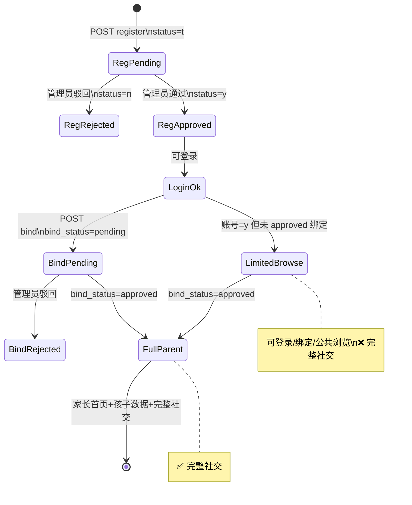

# 移动端产品规格（锁定版 · 开发前必读）

> 更新：2026-06-08（**§十一 已全部确认**）  
> 状态：**产品规格已锁定**（G6 密钥、G7 库表为环境前置）  
> 关联：[README.md](./README.md) · [mobile-sql-decision.md](./mobile-sql-decision.md)  
> **变更**：2026-06 绑定审核增加**教师移动端** `/parent-binds`（与 §八 管理端并行，共用 `mb_parent_child`）

---

## 一、已确认产品决策（2026-06-05）

| # | 决策 | 规格要点 |
|---|------|----------|
| 1 | **家长审核期可登录** | 注册后 **status=t 可登录**，进入 LimitedBrowse（仅绑孩子/看审核状态）；status=y 全功能；status=n 拒绝登录 |
| 2 | **无短信** | 手机号 **仅作登录名**（`login_name` = 11 位手机号）；注册页 **移除验证码** |
| 3 | **绑定审核** | **教师移动端** `/parent-binds` 审核本班申请；**管理端**（§八）校管/Sys_Admin 可并行审核；共用 `mb_parent_child` |
| 4 | **家长完整社交** | 与家长身份匹配的 **留言 / 点赞 / 收藏** 全能力（非只读） |
| 5 | **教研员移动端社交** | 教研员在移动端具备 **带权限控制** 的社交能力（见 §5.3） |
| 6 | **云 ASR** | 采用 **在线 API**；推荐 **阿里云智能语音**（备选讯飞），见 §6 |
| 7 | **勋章后台配规则** | 管理端 CRUD `mb_badge_def` + **手动授予** + 行为自动触发 |

### 1.1 补充确认（§十一 · 2026-06-05）

| 编号 | 决策 |
|------|------|
| **9.1 → A** | 家长 **完整社交** 仅在 **`mb_parent_child.bind_status=approved`** 后开放 |
| **9.2 → A** | **批准** 新增管理端：**家长角色审核**、绑定审核、勋章管理、评论管理 |
| **9.3** | **仅系统管理员** 可软删评论；移动端不展示；**管理后台可见**含已删 |
| **9.4 → A** | 管理端 **支持手动授予** 勋章 |
| **9.5 → A** | `mb_parent_child` **增加** 审核人/时间/驳回原因字段 |

---

## 二、家长端 · 双审核状态机



### 2.1 账号审核（`sys_user`）

| 字段 | 注册值 | 通过后 | 驳回 |
|------|--------|--------|------|
| `login_name` | 手机号 | 不变 | 不变 |
| `user_phone` | 同手机号 | 不变 | 不变 |
| `user_role_id` | `Parent` | 不变 | 不变 |
| `status` | **`t`（待审核）** | **`y`** | **`n`** |
| `root_org_id` | 所选学校 org_id | 不变 | — |

**登录规则**（`MobileAuthLoginService`，**不修改** `AuthServiceImpl`）：

| status | 行为 |
|--------|------|
| `t`（仅 Parent 角色） | **可登录**，进入 LimitedBrowse（绑孩子/审核状态页） |
| `t`（非 Parent 角色） | 403「账号审核中，请耐心等待」 |
| `n` | 403「账号已停用/未通过审核」 |
| `y` | 校验密码，正常签发 token |

支持 `login_name` / `user_phone` 登录。

### 2.2 绑定审核（`mb_parent_child`）— **已确认 9.5**

| 字段 | 提交绑定 | 通过后 | 驳回 |
|------|----------|--------|------|
| `bind_status` | **`pending`** | **`approved`** | **`rejected`** |
| `confirm_user_id` | NULL | 审核人 `user_id` | 审核人 `user_id` |
| `confirm_time` | NULL | 审核时间 | 审核时间 |
| `reject_reason` | NULL | NULL | **必填**驳回说明 |

**DDL**：[`sql/mobile/mb_parent_child_audit_alter.sql`](../sql/mobile/mb_parent_child_audit_alter.sql)（Tier 1 已建库环境 **必跑**）。

**默认**：`MobileParentService` **禁止** auto-approve；`mobile.parent-bind-auto-approve=false`。

### 2.3 功能与审核阶段对照（**9.1 → A 已锁定**）

| 能力 | 账号=t（Parent） | 账号=y，无绑定 | 账号=y，bind=pending/rejected | 账号=y，bind=**approved** |
|------|-------------------|----------------|------------------------------|---------------------------|
| 登录 | ✅（LimitedBrowse） | ✅ | ✅ | ✅ |
| 绑定/新增孩子 | ✅ | ✅ | 显示审核中/驳回 | ✅ 可追加绑定 |
| 家长首页/孩子数据 | 空态引导绑定 | 空态引导绑定 | 审核中/驳回态 | ✅ |
| 公共浏览（实验/模拟实验） | ❌ | ✅ | ✅ | ✅ |
| **完整社交**（§四） | ❌ | ❌ | ❌ | **✅** |

**服务端强制**：Parent 角色调用 `POST /social/comments|reactions` 前，须存在 **至少一条** `bind_status=approved` 的绑定，否则 403「请先完成孩子绑定审核」。

---

## 三、家长注册 · 无短信

> **UI/流程唯一标准**：[`26-parent-register.html`](../frontend/mobile_prototypes/pages/26-parent-register.html)（P26）  
> **绑定孩子 UI 标准**：[`01-bind-child.html`](../frontend/mobile_prototypes/pages/01-bind-child.html)（P01）  
> 开发规矩见 [`.cursor/rules/mobile-prototype-first.mdc`](../.cursor/rules/mobile-prototype-first.mdc) — **严禁胡编乱造**

### 3.1 P26 五步流程（与原型一致）

| 步 | 原型 | Vue 路由 |
|----|------|----------|
| 1 | 家长姓名 · 手机号 · 关系 | `/register/parent` |
| 2 | 选择孩子所在学校 | 同上 |
| 3 | 选择孩子所在年级 | 同上 |
| 4 | 选择孩子所在班级 | 同上 |
| 5 | 确认信息 + 孩子姓名 → **查找学生** → **确认学生** → 提交审核 | 同上 → `/bind-success` |

交互：步骤指示器 · 面包屑 · 选校/年级/班级后 **自动下一步** · 底部 **上一步 / 下一步**（第 5 步为「提交审核」）。

### 3.2 与原型差异（已批准，仅字段/接口）

| 原型有 | 实现 |
|--------|------|
| 短信验证码 | **移除**（无 SMS API） |
| （无） | **增加「设置密码」**（第 1 步，后端 BCrypt） |
| 演示学校名 | **`GET /api/mobile/org/*`** 读 `sys_org` |
| 提交跳转 demo | **`POST /api/mobile/auth/parent/register`** + 管理端双审核 |

`login_name` = 手机号（与 P26 一致）；`user_name` / 昵称 = 家长姓名。

| 字段 | 必填 | 说明 |
|------|------|------|
| `loginName` | ✅ | 手机号 |
| `password` | ✅ | ≥8 位，BCrypt |
| `nickname` | ✅ | 家长姓名 → `user_name` |
| `relation` | ✅ | 与孩子关系 |
| `classOrgId` + `childName` (+ `studentNo`) | ✅ | 第 5 步提交；服务端解析学生；`mb_parent_child` pending |

### 3.3 API

| 方法 | 路径 | 说明 |
|------|------|------|
| POST | `/api/mobile/auth/parent/register` | 创建 Parent `status=t` + pending 绑定 |
| GET | `/api/mobile/org/schools` · `grades` · `classes` | 逐步选择（数据源 `sys_org`，**交互与 P26/P01 一致**） |

---

## 四、社交 · 全站 + 角色权限

### 4.1 内容覆盖

| target_type | 页面 | 社交项 |
|-------------|------|--------|
| `exp_msg` | 实验详情 | 留言、点赞、收藏 |
| `exp_simulator` | 模拟实验详情 | 留言、点赞、收藏 |
| `exp_video` | 视频详情 | 同上 |
| `work` | 作品详情 | 留言、点赞 |

数据表：`mb_comment`、`mb_user_reaction`（`mobile_feature_tables.sql`）。

### 4.2 角色能力（**9.1 / 9.3 已锁定**）

| 角色 | 留言 | 点赞/收藏 | 回复 | 删他人留言（移动端） |
|------|------|-----------|------|----------------------|
| **Student** | ✅ | ✅ | ✅ | ❌（仅删自己的 → 软删或隐藏，MVP 可不做） |
| **Teacher** | ✅ | ✅ | ✅ | ❌ |
| **Parent** | ✅（**bind=approved 后**） | ✅ 同上 | ✅ | ❌ |
| **Researcher** | ✅（须 `mobile-social-comment`） | ✅（须 `mobile-social-react`） | ✅ | ❌ |

**评论软删（9.3）**

| 项 | 规则 |
|----|------|
| 谁可删 | **仅 `Sys_Admin`（系统管理员）** |
| 怎么做 | `mb_comment.status`：`y` → `n`；写入 `deleted_by`、`deleted_time` |
| 移动端列表 | `GET /mobile/social/comments` **仅 `status=y`** |
| 管理后台 | `GET /mobile/admin/comments` **含已删**；可按 status 筛选；展示删除人与时间 |
| 物理删除 | **禁止**；仅软删 |

`user_role_tag`：`student` / `teacher` / `parent` / `researcher` / `author`。

### 4.3 统一 Mobile API

| 方法 | 路径 | 说明 |
|------|------|------|
| GET | `/api/mobile/social/comments` | 分页；**仅 status=y** |
| POST | `/api/mobile/social/comments` | 发表/回复；Parent 须 bind approved |
| POST | `/api/mobile/social/reactions` | like/collect；Parent 须 bind approved |
| GET | `/api/mobile/social/stats` | 当前用户态 + 计数 |

移动端 **不提供** 删他人评论接口。软删仅管理端：

| 方法 | 路径 | 权限 |
|------|------|------|
| GET | `/api/mobile/admin/comments` | Sys_Admin；含已删 |
| PATCH | `/api/mobile/admin/comments/{id}` | Sys_Admin；`status=n` + deleted_by/time |

---

## 五、教研员移动端

### 5.1 导航（`RESEARCHER_TABS`）

首页 · 模拟实验 · 发现/搜索 · 我的（与现有学生导航区分）。

### 5.2 登录

`userRoleId=Researcher`（如 `yuanf`）→ 教研员主题与 Tab；**禁止**登录 Tab 覆盖服务端角色。

### 5.3 社交权限（已确认须权限）

权限锚点建议（`sys_menu.menu_code` 新增，供角色授权）：

| menu_code | 能力 |
|-----------|------|
| `mobile-social-comment` | 发表/回复评论 |
| `mobile-social-react` | 点赞/收藏 |

**评论软删不在移动端**；由 **系统管理员** 在管理后台操作（§4.2）。

**实现**：Mobile API 内校验当前用户 `sys_user_role` / 菜单权限，**不修改**现有 `RoleController` 逻辑，新增 `MobileSocialAuthHelper` 只读查询。

---

## 六、云 ASR 推荐方案

### 6.1 推荐：**阿里云智能语音交互 · 一句话识别**

| 项 | 说明 |
|----|------|
| 产品 | [阿里云 ISI 一句话识别](https://help.aliyun.com/document_detail/84428.html) REST |
| 理由 | 普通话/K12 场景成熟、按量计费、Java SDK 完善、与现有 Spring 后端易集成 |
| 备选 | **讯飞开放平台** 语音听写（流式版）— 可通过 `mobile.asr-provider=xunfei` 切换 |
| 不推荐 | 服务器自建 Whisper/Vosk（除非离线专网） |

### 6.2 架构

```
VoiceSearchView / AssistantChatView
  → MediaRecorder 录音（webm/wav，≤60s）
  → POST /api/mobile/asr/transcribe（multipart）
  → MobileAsrService
       ├─ provider=aliyun → AccessKey + NLS REST
       └─ provider=xunfei  → AppId + APIKey
  → { text: "彩虹液体分层" }
  → router.push(`/search?q=${text}`)

降级：浏览器 Web Speech API（mobile.asr-fallback=browser）
```

### 6.3 配置项

```yaml
mobile:
  asr:
    provider: aliyun          # aliyun | xunfei | browser-only
    aliyun:
      access-key-id: ${ALIYUN_AK}
      access-key-secret: ${ALIYUN_SK}
      app-key: ${NLS_APP_KEY}
    xunfei:
      app-id: ${XF_APP_ID}
      api-key: ${XF_API_KEY}
    fallback-browser: true
```

---

## 七、勋章 · 管理后台配置规则

### 7.1 原则

- **`mb_badge_def` 由管理端 CRUD**；生产环境 **不依赖** `mobile_badge_def_seed.sql`
- **`mb_badge_progress` 仅运行时写入**（学生行为触发判定）
- SQL seed 文件仅 **dev 空库快速体验** 可选

### 7.2 规则字段（`mb_badge_def`）

| 字段 | 管理端可配 |
|------|------------|
| icon, title, description | ✅ |
| criteria_type | ✅ 下拉枚举（见下） |
| criteria_value | ✅ 阈值 |
| action_route, sort_order, status | ✅ |

**criteria_type 枚举（MVP）**

`work_first` · `work_submit_count` · `exp_task_done` · `quiz_first` · `quiz_correct` · `quiz_streak` · `work_featured`

### 7.3 管理端需求（**9.4 已确认：含手动授予**）

| 功能 | API | 说明 |
|------|-----|------|
| 勋章规则 CRUD | `CRUD /api/mobile/admin/badges` | 维护 `mb_badge_def` |
| **手动授予/撤销** | `POST /api/mobile/admin/badges/grant` | body: `{ userId, badgeId, earned: true\|false }` → 写 `mb_badge_progress` |
| 查看用户勋章 | `GET /api/mobile/admin/badges/progress?userId=` | 管理端查询 |

自动授予：`MobileBadgeGrantService` 在 work/quiz/task 提交后仍按规则更新 progress；与手动授予 **可并存**（手动 `earned=y` 不被自动逻辑覆盖）。

Mobile 端 `GET /api/mobile/badges` 只读定义 + 当前用户 progress。

---

## 八、管理端工作包（**9.2 已批准**）

> **范围扩展已批准**：允许 **新增** 管理端页面 + `com.xuanyue.exp.mobile.admin` API；**禁止修改** 已有 Controller/Service 业务逻辑。

| 模块 | 管理端页面（新建） | 后端 API | 操作角色 |
|------|-------------------|----------|----------|
| **家长角色审核** | 待审核家长注册列表 | `GET/PATCH .../admin/parent-registrations` | 校管 / **Sys_Admin** |
| **绑定审核** | 待审核绑定列表 | `GET/PATCH .../admin/parent-binds` | 校管 / **Sys_Admin** |
| **勋章规则** | 勋章定义管理 | `CRUD .../admin/badges` | 教研 / **Sys_Admin** |
| **手动授勋** | 用户勋章授予弹窗 | `POST .../admin/badges/grant` | **Sys_Admin** |
| **评论管理** | 评论列表（含已软删） | `GET/PATCH .../admin/comments` | **仅 Sys_Admin** |

**菜单建议**（`sys_menu` 新增）：`mobile-parent-audit` · `mobile-bind-audit` · `mobile-badge-mgmt` · `mobile-comment-mgmt`

**角色授权（已确认）**：**不在 SQL 中写角色-菜单绑定**。执行 `sql/mobile/mobile_sys_menu.sql` 注册菜单后，由运维/管理员在现有 **管理后台 → 角色管理** 为 `School_Admin` / `Sys_Admin` 等角色勾选对应菜单。API 侧仍做 **数据范围** 校验（见 §十三）。

**现有能力复用评估**

| 已有 | 是否够用 |
|------|----------|
| `UserManagementView` 启用/停用 | ❌ 无「待审核 t」筛选与专用流程 |
| 实验审核 `AuditExpStandard` | 模式可借鉴，需 **新建** 家长/绑定审核页 |

---

## 九、开发门禁

| # | 检查项 | 状态 |
|---|--------|------|
| G1 | 9.1 → A：绑定 approved 后才可完整社交 | ✅ |
| G2 | 9.2 → A：批准新增管理端（含家长角色审核） | ✅ |
| G3 | 9.3：仅 Sys_Admin 软删；后台可见已删 | ✅ |
| G4 | 9.4 → A：勋章手动授予 | ✅ |
| G5 | 9.5 → A：`mb_parent_child` 审核字段 DDL | ✅ |
| G6 | 阿里云/讯飞 ASR 密钥（R4 前） | ⬜ 运维 |
| G7 | Tier 1 + feature 表 + **audit alter** 已执行 | ✅ |
| G8 | 测试数据走 [mobile-test-data-playbook.md](./mobile-test-data-playbook.md) | ✅ 已认可 |

**R0 可开工**；R4 前需完成 G6。

---

## 十、修订 Release（含管理端）

| Release | 交付 |
|---------|------|
| **R0 · 管理端** | 家长角色审核 + 绑定审核 + 勋章 CRUD/手动授予 + 评论管理（Sys_Admin 软删） |
| **R1** | 学生/教师核心去 mock；答题接题库 |
| **R2** | 家长注册（无短信）+ 双审核 + 登录包装 + 家长端（社交 gated） |
| **R3** | 社交全站 + 教研员 Tab/权限 + 勋章自动授予 |
| **R4** | 阿里云 ASR + 删 prototype + 治理 |

---

## 十一、已确认决策记录（2026-06-05）

| 编号 | 你的选择 | 写入规格 |
|------|----------|----------|
| 9.1 | **A** | §2.3、§4.2 Parent 社交门槛 |
| 9.2 | **A** | §八 管理端工作包 |
| 9.3 | Sys_Admin 软删，后台可见 | §4.2、§4.3、§八 |
| 9.4 | **需要** 手动授予 | §7.3 |
| 9.5 | **A** 审核字段 | §2.2、DDL 脚本 |

---

## 十三、实现默认（2026-06-05 采纳）

| # | 议题 | 默认 |
|---|------|------|
| 1 | 校管审核数据范围 | **School_Admin** 仅见/改 **同 `root_org_id`**；**Sys_Admin** 全局 |
| 2 | 家长驳回后同手机号 | **允许再次注册**（R2 注册 API 对 `status=n` 同 `login_name` 做 upsert 更新） |
| 3 | 绑定孩子匹配 | **姓名 + 学号 + 学校 org** 三重匹配 `sys_user`(Student)（R2 实现） |
| 4 | 手动授勋 vs 自动 | `earned=y` 后自动逻辑 **不降级**；progress 仍可累加（R0/R3） |
| 5 | 勋章规则 CRUD | **教研 + Sys_Admin** 可维护规则；**手动 grant 仅 Sys_Admin** |
| 6 | `mb_quiz_daily` 配置 | R1 前 dev **手工 SQL**；R1 可扩展题库页 |
| 7 | **角色授权** | **管理后台角色管理**勾选菜单；SQL **只插 `sys_menu`** |

**`sys_user.status` 扩展**：`y` 启用 · `n` 停用/驳回 · **`t` 待审核**（家长注册专用，字典注释待 R0 后补）。

---

## 十四、与旧文档关系

| 文档 | 变更 |
|------|------|
| **本文** | **最高优先级产品真相**；与本文冲突以本文为准 |
| mobile-no-mock-analysis.md | 战术分析；§八/§十一/§十二 部分已被本文 supersede |
| mobile_badge_def_seed.sql | 降为 **dev 可选**；生产由管理端配置 |
| mobile-development-constraints.mdc | 需增补 **「允许新增管理端页面 + mobile.admin API」** |
